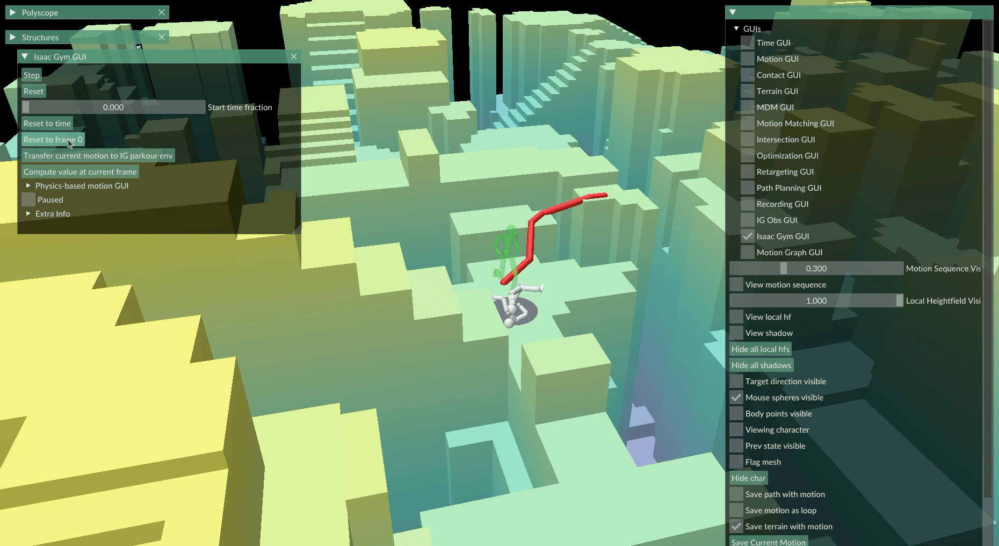

# PARC

Project page: https://michaelx.io/parc

```bibtex
@inproceedings{xu2025parc,
    author = {Xu, Michael and Shi, Yi and Yin, KangKang and Peng, Xue Bin},
    title = {PARC: Physics-based Augmentation with Reinforcement Learning for Character Controllers},
    year = {2025},
    booktitle={SIGGRAPH 2025 Conference Papers (SIGGRAPH '25 Conference Papers)}
}
```

# Getting Started
Tested with Ubuntu 22.04

Install IsaacGym: https://developer.nvidia.com/isaac-gym

Make sure to install it within a conda environment with python 3.8.19 (Other versions may also work, but not tested).

Install requirements:
```
conda activate parc
pip install -r requirements.txt
```
and it should be good to go. If pytorch is not being able to detect CUDA, try reinstalling:
```
pip install torch==1.13.1+cu117 -f https://download.pytorch.org/whl/torch_stable.html
```

## Dataset and Models
Download the datasets from the initial iteration and each stage of PARC, as well as the models trained in the 3rd PARC iteration.
These files are loaded with anim/motion_lib.py and anim/kin_char_model.py.
You can view them with motion_forge.py, by editing the "motion_filepath" param in MOTION_FORGE/motion_forge_config.yaml
https://1sfu-my.sharepoint.com/:f:/g/personal/mxa23_sfu_ca/Et16uLMFxoRKouibvBa7LbwBEmX5_iI5a8dZyiMc0wmSTA?e=ihma1b
The password is "PARC".
The initial motion capture data was captured at Beyond Capture Studios, and funded by the NSERC Discovery Grant RGPIN-2024-06752.

## Codebase Guide
The PARC training loop consists of 4 main stages, which are individually run by:
```
python parc_1_train_gen.py --config path/to/config
python parc_2_kin_gen.py --config path/to/config
python parc_3_tracker.py --config path/to/config
python parc_4_phys_record.py --config path/to/config
```

These modules are independent and flexibly configured using configuration files. However, to aid in setting up all the configuration files for a PARC iteration, we provide the following script:
```
parc_0_setup_iter.py
```

To create a dataset file, we provide the script:
```
parc_5_create_dataset.py
```
This file also computes sampling weights, which is useful when there is much more motion data for certain types of clips than others (e.g. lots of running motions, few climbing motions). It also pre-computes some terrain data that will help with augmentation when training the motion diffusion model.

## PARC Scripts Overview

This section provides brief descriptions of the key scripts in the PARC training loop and supporting tools:

- **parc_0_setup_iter.py**: Automates the creation of configuration files for a PARC iteration, setting up paths and parameters for all stages to ensure consistency.

- **parc_1_train_gen.py**: Trains the Motion Diffusion Model (MDM) using the dataset to generate kinematic motions, supporting features like heightmap observations and target conditioning.

- **parc_2_kin_gen.py**: Generates new kinematic motions on procedurally created terrains (e.g., boxes, paths, stairs) using the trained MDM, with optional optimization for contact and penetration losses.

- **parc_3_tracker.py**: Trains a reinforcement learning tracker to follow generated kinematic motions in a physics simulation environment, producing a model for physical tracking.

- **parc_4_phys_record.py**: Records physical simulations of tracked motions to augment the dataset, using the trained tracker model in Isaac Gym.

- **parc_5_create_dataset.py**: Creates or updates the dataset YAML file from motion data folders, computing sampling weights and optionally preprocessing terrain data for balanced training.

These scripts form the core of the PARC iteration process, enabling physics-based data augmentation for character controllers.

## Data
组织文件：create_dataset_config.yaml
    ```motions:
      - class: "running"  # 基于文件夹名称的运动类
        file: "../Data/initial/running_001.pkl"  # .pkl 文件相对/绝对路径
        weight: 1.0  # 采样权重，默认 1.0；可基于文件数比例计算
      - class: "jumping"
        file: "../Data/initial/jumping_002.pkl"
        weight: 0.5  # 如果 cut_some_classes_in_half=True，此类文件可能减半，权重调整
    char_filepath: "data/assets/humanoid.xml"  # humanoid 模型 XML
    max_terrain_dim_x: 45  # 地形维度限制
    max_terrain_dim_y: 45```

运动序列文件：
    ```{
        """
        check: _get_char_state()
        Keys in data: dict_keys(['fps', 'loop_mode', 'frames', 'contacts', 'obs', 'obs_shapes', 'terrain'])
        fps: 30
        loop_mode: CLAMP
        frames: shape (265, 34), dtype float32
        contacts: shape (265, 15), dtype float32
        obs: shape (265, 1312), dtype float32
        obs_shapes: type <class 'collections.OrderedDict'>
        terrain: type <class 'util.terrain_util.SubTerrain'>
        """
        "frames": torch.Tensor([...])  # [num_frames, dof] 
        "contacts": torch.Tensor([...])
        "terrain": SubTerrain(...)  # 自定义对象：高度图 hf (torch.Tensor [dim_x, dim_y])、dims、dx/dy 等
        "fps": 30  # 帧率 (sequence_fps)
        "loop_mode": "CLAMP"  # 循环模式
        "hf_mask_inds": torch.Tensor([...])  # 可选：高度图掩码索引 (用于增强)
        "loss": float  # 可选：生成损失 (e.g., contact_loss)
        "opt:body_constraints": dict(...)  # 可选：优化约束 (e.g., 身体点采样)
    }```

## MOTION_FORGE
The mouse cursor controls target direction and editing of terrain.

Hotkeys:
A: Change terrain height
N: Place waypoint
G: Generate motion

Quick way to test motion generator and tracker:
1. Load terrain with motion_forge.py (config file is in MOTION_FORGE/motion_forge_config.yaml).
2. Place two waypoints using N
3. Create path using GUIs -> Path Planning GUI -> A*
4. Generate motion frames using GUIs -> Path Planning GUI -> Generate Frames from start until end of path (May need to adjust max motion length in "MDM gen along path config", default is 10 seconds)
5. Select and view generated motions in GUIs -> Motion GUI -> Loaded Motions
6. Test tracker with GUIs -> Isaac Gym GUI -> Start Isaac Gym, then "Transfer Current Motion to Isaac Gym GUI" (This requires you to hard code the terrain and model paths in MOTION_FORGE/include/isaac_gym_gui.py)

You can also load the default terrain with it's default motion, and go to step 6 right away.

You can also generate motions based on the current motion frame and target direction using the "G" key.

Edit the terrain using the "A" key, and check out what you can do with the Terrain GUI.

Motion forge is built on top of a wonderful tool called Polyscope: https://polyscope.run/py/

If you use Motion Forge in your research, please consider citing:
```bibtex
@software{Xu_Michael_Motion_Forge,
  author = {Xu, Michael and Peng, Xue Bin},
  title = {{Motion Forge}},
  year = {2025},
  month = aug,
  version = {0.0.1},
  url = {https://github.com/mshoe/PARC},
  license = {MIT}
}
```

## TODO
- train and release more iterations of PARC generator and tracker
- better isaac gym terrain integration, so edited terrain can be simulated immediately instead of reloading from config files
- MOTION FORGE will get a complete overhaul to be more user-friendly

## Example of Issac Gym Integration in Motion Forge
